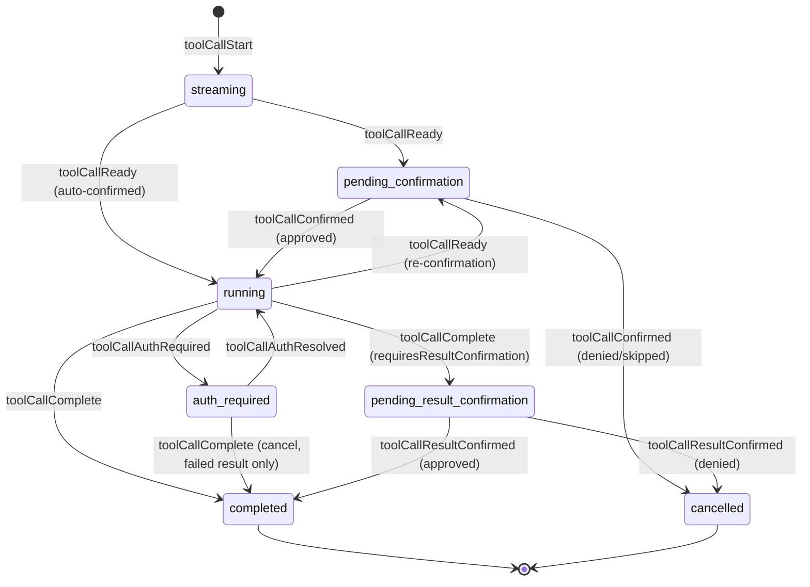
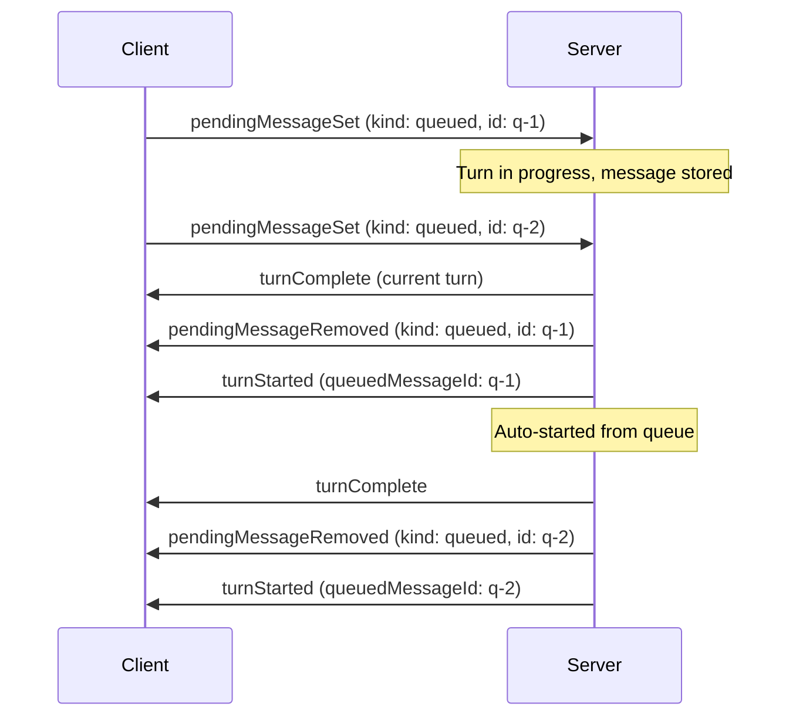
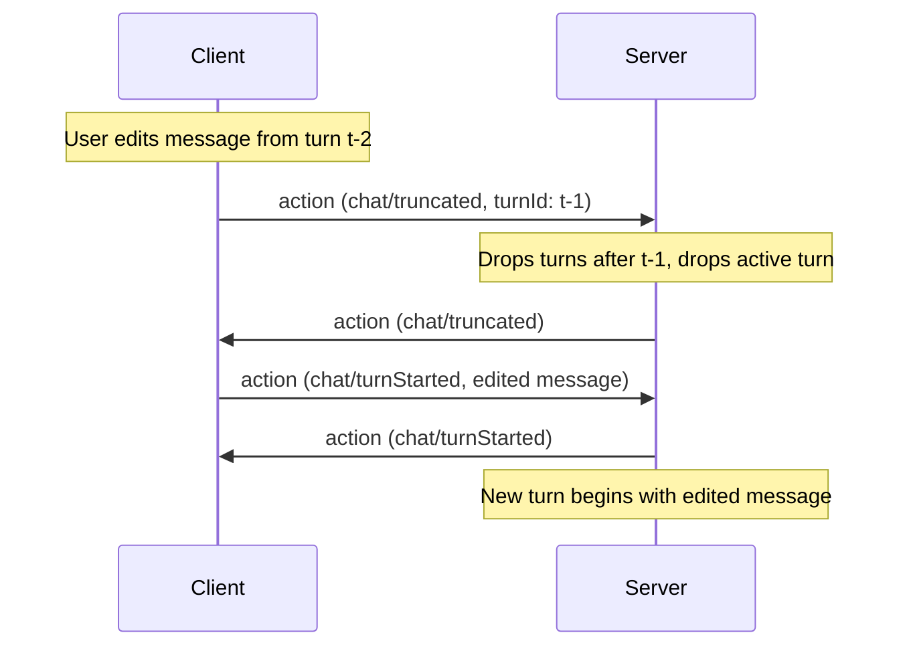

# State Model

All state in AHP is organised into **channels**, each addressed by a URI. Clients subscribe to a channel URI to receive its current state snapshot and subsequent action updates. See [Channels & Subscriptions](/specification/subscriptions) for the channel model.

## Root State

Subscribable on the [Root Channel](/specification/root-channel) at `ahp-root://`. Contains global, lightweight data that all clients need. **Does not contain the session list** — that is fetched imperatively via RPC (see [`listSessions`](/reference/root#listsessions)) and kept in sync via `root/sessionAdded` / `root/sessionRemoved` / `root/sessionSummaryChanged` notifications.

```typescript
RootState {
  agents: AgentInfo[]
  activeSessions?: number     // count of non-disposed sessions
  terminals?: TerminalInfo[]  // lightweight terminal catalogue
  config?: RootConfigState    // host-level configuration
}
```

Each `AgentInfo` includes the models available for that agent:

```typescript
AgentInfo {
  provider: string         // e.g. 'copilot'
  displayName: string
  description: string
  models: SessionModelInfo[]
  customizations?: Customization[]  // Open Plugins
}

SessionModelInfo {
  id: string
  provider: string
  name: string
  maxContextWindow?: number
  supportsVision?: boolean
  policyState?: 'enabled' | 'disabled' | 'unconfigured'
  configSchema?: ConfigSchema   // model-specific options (e.g. thinking level)
  _meta?: Record<string, unknown>  // intrinsic facts (e.g. pricing); see below
}

ConfigSchema {
  type: 'object'
  properties: Record<string, ConfigPropertySchema>
  required?: string[]
}

ConfigPropertySchema {
  type: 'string'
  title: string
  description?: string
  default?: string
  enum: string[]                 // allowed values
  enumLabels?: string[]          // display labels (parallel array)
  enumDescriptions?: string[]    // descriptions (parallel array)
  readOnly?: boolean
}
```

When a model has a `configSchema`, clients present it as a form and pass the resolved values in a `ModelSelection` (carried on each [`Message`](#user-messages)).

`_meta` carries additional provider-specific metadata. Clients MAY look for well-known keys here to provide enhanced UI — for example, a `pricing` key may carry model pricing metadata.

Root state is mutated only by server-originated actions (e.g. `root/agentsChanged`).

## Session State

Subscribable on a [Session Channel](/specification/session-channel) at `ahp-session:/<uuid>`. Contains the full state for a single session.

```typescript
SessionState {
  // Session metadata, inlined directly (mirrored into the root-channel SessionSummary)
  provider: string
  title: string
  status: number        // SessionStatus bitset
  activity?: string
  project?: ProjectInfo
  workingDirectories?: URI[]   // equal-peer working directories
  annotations?: AnnotationsSummary

  lifecycle: 'creating' | 'ready' | 'creationFailed'
  creationError?: ErrorInfo
  chats: ChatSummary[]                     // catalog of chats in this session
  defaultChat?: URI                        // input-routing hint
  activeClients: SessionActiveClient[]
  customizations?: Customization[]         // active session plugins
  changesets?: Changeset[]
  config?: SessionConfigState
}
```

The session metadata fields above are inlined onto `SessionState`. The same fields are mirrored into the lightweight [`SessionSummary`](#session-summary) catalog entry on the root channel; the host keeps the two in sync via periodic `root/sessionSummaryChanged`.

### Lifecycle

The `lifecycle` field tracks the asynchronous creation process. When a client creates a session, it picks a URI, sends the command, and subscribes immediately. The initial snapshot has `lifecycle: 'creating'`. The server asynchronously initializes the backend and dispatches `session/ready` or `session/creationFailed`.

### Session Summary

Lightweight metadata used in the session list and embedded within session state:

```typescript
SessionSummary {
  resource: URI
  provider: string
  title: string
  status: number  // SessionStatus bitset
  activity?: string
  createdAt: string   // ISO 8601, e.g. "2025-03-10T18:42:03.123Z"
  modifiedAt: string  // ISO 8601
  project?: ProjectInfo
  workingDirectories?: URI[]   // equal-peer working directories
  annotations?: AnnotationsSummary
  changes?: ChangesSummary
}

ProjectInfo {
  uri: URI
  displayName: string
}
```

The `status` bitset encodes both the session's activity state and metadata flags like read/archived state. See the [Session Status Bitset](#session-status-bitset) table below for details.

### Session Status Bitset

`status` is a numeric bitset. Clients SHOULD use bitwise checks instead of string or equality checks for activity states:

| Name                        | Value | Bits                   | Meaning                                                                                                                                                                               |
| --------------------------- | ----: | ---------------------- | ------------------------------------------------------------------------------------------------------------------------------------------------------------------------------------- |
| `SessionStatus.Idle`        |   `1` | `1 << 0`               | No active turn and no pending input request.                                                                                                                                          |
| `SessionStatus.Error`       |   `2` | `1 << 1`               | The most recent turn ended with an error.                                                                                                                                             |
| `SessionStatus.InProgress`  |   `8` | `1 << 3`               | A turn is active.                                                                                                                                                                     |
| `SessionStatus.InputNeeded` |  `24` | `(1 << 3) \| (1 << 4)` | A turn is active and either at least one user input request is open, or at least one tool call is awaiting user confirmation (pre- or post-execution). Includes the `InProgress` bit. |
| `SessionStatus.IsRead`      |  `32` | `1 << 5`               | The client has viewed this session since its last modification. Cleared automatically when a new turn starts or an input request arrives. Toggled via `session/isReadChanged`.        |
| `SessionStatus.IsArchived`  |  `64` | `1 << 6`               | The session has been archived by the client. Toggled via `session/isArchivedChanged`.                                                                                                 |

Bits 0–4 encode mutually-exclusive **activity** status (exactly one is set at a time). Bits 5+ encode orthogonal **metadata** flags that may be combined with any activity status via bitwise OR.

For example, `(status & SessionStatus.InProgress) !== 0` is true for both `InProgress` and `InputNeeded`. A session that is idle, read, and archived has status `1 | 32 | 64 = 97`.

## Chat State

Subscribable on a [Chat Channel](/specification/chat-channel) at `ahp-chat:/<cid>`. A session is a catalog of chats (`SessionState.chats`); each chat carries the per-conversation state — the turn history, the active turn and its streaming response parts (including live input requests), tool calls, steering/queued messages, and the user's in-progress draft. A session starts with a default chat (`SessionState.defaultChat`); hosts advertising the `multipleChats` capability let clients open more via `createChat`.

```typescript
ChatState {
  // Chat summary fields, inlined directly (mirrored into SessionState.chats)
  resource: URI
  title: string
  status: number          // SessionStatus bitset
  activity?: string
  modifiedAt: string
  origin?: ChatOrigin      // how the chat came to exist (user / fork / sideChat / tool)
  workingDirectories?: URI[]      // subset of session's workingDirectories

  turns: Turn[]                       // completed turns
  turnsNextCursor?: string            // page older turns via fetchTurns
  activeTurn?: ActiveTurn             // the in-progress turn, if any
  steeringMessage?: PendingMessage
  queuedMessages?: PendingMessage[]
  draft?: Message                     // user's in-progress input
}
```

Fork and side-chat creation both reference source turns by stable identifiers.
Both source forms are fully discriminated — `{ kind: 'fork', chat, turnId }`
and `{ kind: 'sideChat', chat, turnId, selection? }`. For side chats, hosts
resolve `turnId` against either `activeTurn` or historical `turns` at creation
time. If it names the active turn, the host snapshots the currently available
response there, which preserves `/btw`-style side chats even though that same
turn later moves into `turns` when it completes. When `selection` is present,
the host also snapshots that exact selected text (which MUST be non-empty) into
the created chat's `origin`; `responsePartId` there is advisory provenance, not
a range.

The sections below — turns, response parts, tool calls, pending messages, and input requests — describe the contents of `ChatState`.

## Turns

A turn represents one request/response cycle between user and agent.

### Completed Turn

```typescript
Turn {
  id: string
  message: Message
  responseParts: ResponsePart[]     // all content in stream order
  usage: UsageInfo | undefined
  state: 'complete' | 'cancelled' | 'error'
}
```

`state: 'error'` is the convenient top-level signal that processing stopped on
an error. The detailed error and any recovery interaction live in an
`ErrorResponsePart`, preserving their position in the response stream.

### Active Turn

An in-progress turn where the assistant is actively streaming:

```typescript
ActiveTurn {
  id: string
  message: Message
  responseParts: ResponsePart[]     // all content in stream order
  usage: UsageInfo | undefined
}
```

### User Messages

```typescript
Message {
  text: string
  origin: { kind: MessageKind }
  attachments?: MessageAttachment[]
  model?: ModelSelection   // selection this message was/will-be sent with
  agent?: AgentSelection   // custom agent this message was/will-be sent with
  _meta?: Record<string, unknown>  // provider-specific metadata; see below
}

ModelSelection {
  id: string                             // model ID
  config?: Record<string, string>        // model-specific config values
}

AgentSelection {
  uri: URI                               // stable custom-agent URI
}

type MessageAttachment =
  | SimpleMessageAttachment            // type: 'simple'
  | MessageEmbeddedResourceAttachment  // type: 'embeddedResource'
  | MessageResourceAttachment          // type: 'resource'

// Common fields shared by all variants:
MessageAttachmentBase {
  label: string                  // human-readable label, e.g. filename
  range?: TextRange              // range in `text` that references this attachment
  displayKind?: 'image' | 'document' | 'symbol' | 'directory' | 'selection' | string
  _meta?: Record<string, unknown>
}

TextRange {
  start: { line: number, character: number }  // zero-based text position
  end: { line: number, character: number }
}

TextSelection {
  range: TextRange
}

MessageResourceAttachment {
  type: 'resource'
  uri: URI
  displayKind?: 'selection'
  selection?: TextSelection
}
```

A message's `origin.kind` records who produced the message: `user` for a direct user message, `agent` for one the agent produces itself, `tool` for one a tool produces (for example, seeding the first message of a worker chat it spawned), and `systemNotification` for a system-generated notification. For the message that initiates a turn this is also the origin of the turn; for steering or queued messages it is just the origin of that message. A client is only allowed to send `user` messages.

A message's optional `model` / `agent` record the selection it was, or will be, sent with. For historic turns this is the selection actually used, so a client editing or resending a message can retain it; when omitted, the agent host's default applies. A chat also exposes a `draft`: the [`Message`](#user-messages) the user is composing but has not sent yet (including its `model` / `agent`). Clients MAY periodically sync their input state into `draft` via `chat/draftChanged` (debounced, not eager) and SHOULD initialize input UI for an existing chat from any present `draft`.

Attachments MAY be referenced inline by `text` via the optional `range` field, which points at a span in the message text. This is a text range, not a byte range. Attachments without a range are still associated with the message but are not anchored to a specific span.

Resource and embedded-resource attachments MAY also include `selection` to identify a selected range within the attached textual resource. This is distinct from `range`, which only describes where the attachment is referenced in the user message text. Selected text is not embedded inline; consumers can resolve the resource and read the selected range when needed. `selection` is only meaningful for textual resources; binary resources may still use resource or embedded-resource attachments, but they should not use this text selection field.

Use `SimpleMessageAttachment` for opaque attachments whose model representation is supplied by the producer, `MessageEmbeddedResourceAttachment` for small inline base64 payloads (e.g. a pasted image), and `MessageResourceAttachment` to reference a resource by URI (the content is fetched via `resourceRead` when needed).

`Message._meta` carries additional provider-specific metadata for the message itself (independent of any attachment `_meta` blob). Clients MAY look for well-known keys here to provide enhanced UI, and agent hosts MAY use it to carry context that does not fit any other field. Mirrors the [MCP `_meta` convention](https://modelcontextprotocol.io/specification/2025-06-18/basic#meta).

Attachments produced by the [`completions`](#user-message-completions) command MAY include a `_meta` blob; clients MUST preserve every property of `_meta` when echoing the attachment back in the user message.

### User-Message Completions

To support `@`-mention pickers and similar inline-completion experiences, the client can call the `completions` command while the user is composing a message:

```typescript
CompletionsParams {
  kind: 'userMessage'      // CompletionItemKind.UserMessage
  channel: URI
  text: string             // full text typed so far
  offset: number           // cursor offset (UTF-16 code units)
}

CompletionsResult {
  items: CompletionItem[]
}

CompletionItem {
  insertText: string
  rangeStart?: number      // range in `text` to replace; insertion at cursor if omitted
  rangeEnd?: number
  attachment: MessageAttachment
}
```

Servers advertise the characters that should auto-trigger this request via `InitializeResult.completionTriggerCharacters` (e.g. `['@', '#']`). Clients MAY also issue `completions` calls in response to explicit user actions (such as a keyboard shortcut). When the user accepts an item, the client replaces `[rangeStart, rangeEnd)` in the input with `insertText` and associates the item's `attachment` with the resulting `Message`.

Hosts that support the common terminal-command shorthand advertise `InitializeResult.terminalCommandPrefix` as `"!"`. Clients can use that marker to explain that messages beginning with `!` will be interpreted by the host as terminal commands; when the marker is absent, clients should treat `!`-prefixed text as an ordinary user message.

## Response Parts

All response content — text, tool calls, reasoning, and content references — lives in a single `responseParts` array in stream order. This mirrors how LLM APIs (e.g. OpenAI) represent responses as a unified list of typed items.

```typescript
// Inline markdown content
MarkdownResponsePart {
  kind: 'markdown'
  id: string               // targeted by chat/delta for text appends
  content: string
}

// Reasoning/thinking content from the model
ReasoningResponsePart {
  kind: 'reasoning'
  id: string               // targeted by chat/reasoning for text appends
  content: string
}

// Tool call (see Tool Call Lifecycle below)
ToolCallResponsePart {
  kind: 'toolCall'
  toolCall: ToolCallState   // full lifecycle state
}

// Response-part wrapper around a large content reference
ResourceResponsePart {
  kind: 'contentRef'
  uri: string
  sizeHint?: number
  contentType?: string
  nonce?: string           // changes when the referenced content changes
}

// Harness-authored notification surfaced in the stream (e.g. "subagent finished")
SystemNotificationResponsePart {
  kind: 'systemNotification'
  content: StringOrMarkdown
  _meta?: Record<string, unknown>   // machine-readable trigger metadata; see below
}

// Durable record of a resolved input request (see Input Requests below)
InputRequestResponsePart {
  kind: 'inputRequest'
  request: ChatInputRequest   // the resolved request, with its final answers
  response: ChatInputResponseKind  // 'accept' | 'decline' | 'cancel'
}

// Durable error and recovery record
ErrorResponsePart {
  kind: 'error'
  id: string
  error: ErrorInfo
  recovery?: {
    options: ErrorRecoveryOption[]       // host-provided actions
    selectedOptionId?: string            // durable user decision
  }
}
```

`SystemNotificationResponsePart._meta` carries provider-specific metadata describing what triggered the notification. A host MAY attach a machine-readable descriptor so clients can categorize, icon, group, filter, or localize the notification without parsing `content`. Clients MAY inspect well-known keys for enhanced UI, and MUST render coherently from `content` alone when `_meta` is absent or unrecognized.

Text content uses a **create-then-append** pattern: the server first emits a `chat/responsePart` action to create a new markdown (or reasoning) part with an `id`, then streams text into it via `chat/delta` (or `chat/reasoning`) actions targeting that `partId`. This pattern is extensible to future streaming content types.

Clients fetch `ContentRef` content separately via the `resourceRead(uri)` command. This keeps the state tree small and serializable.

Consumers can derive display text by concatenating all `markdown` parts, find tool calls by filtering for `toolCall` parts, and access reasoning by filtering for `reasoning` parts.

An error part without `recovery` is unrecoverable. When recovery is present and
`selectedOptionId` is absent, clients render its ordered options and dispatch
`chat/errorRecoverySelected` with the turn, part, and option identifiers. The
reducer records the selected option ID on the part and reopens the same turn
without adding a user message. If processing fails again, the host appends
another error part; prior errors and selections remain in stream order.

## Tool Call Lifecycle

Tool calls are represented as a discriminated union on `status`, where each state only exposes the fields valid for that phase.



### States

| Status                        | Key Fields                                                           | Description                                                                                                                                                                                                                                                                            |
| ----------------------------- | -------------------------------------------------------------------- | -------------------------------------------------------------------------------------------------------------------------------------------------------------------------------------------------------------------------------------------------------------------------------------- |
| `streaming`                   | `partialInput?`, `invocationMessage?`                                | LM is streaming tool call parameters. `partialInput` accumulates when deltas include parameter content. |
| `pending-confirmation`        | `invocationMessage`, `toolInput?`, `edits?`, `editable?`, `options?` | Parameters complete or mid-execution confirmation needed. `toolInput` may be inline or a `ContentRef`, at the host's discretion. `edits` previews file changes. `editable` indicates the client may edit parameters before confirming. `options` provides server-defined choices beyond simple approve/deny (see below). Uses `_meta` for additional context. |
| `running`                     | `confirmed`, `selectedOption?`                                       | Tool is executing. `confirmed` records how it was approved. `selectedOption` holds the chosen confirmation option, if any.                                                                                                                                                             |
| `auth-required`               | `confirmed`, `selectedOption?`, `contributor` (MCP), `auth`          | Execution paused pending MCP authentication (see below). Only reachable for MCP-contributed tool calls.                                                                                                                                                                               |
| `pending-result-confirmation` | `success`, `pastTenseMessage`, `content?`, `selectedOption?`         | Execution finished, waiting for client to approve the result.                                                                                                                                                                                                                          |
| `completed`                   | `success`, `pastTenseMessage`, `content?`, `selectedOption?`         | Terminal state. Tool finished.                                                                                                                                                                                                                                                         |
| `cancelled`                   | `reason`, `reasonMessage?`, `userSuggestion?`, `selectedOption?`     | Terminal state. `reason` is `'denied'`, `'skipped'`, or `'result-denied'`.                                                                                                                                                                                                             |

`confirmed`, `selectedOption?` are pulled into a shared `ToolCallPostConfirmationFields` base since the invariant — "confirmation has already been resolved" — holds for every state reachable only after `pending-confirmation`: `running`, `auth-required`, `pending-result-confirmation`, and `completed`. `pending-confirmation` itself (not yet confirmed) and `cancelled` (the denial path, which never ran) keep their own fields instead.

### Mid-execution Re-confirmation

When a running tool needs additional user approval (e.g. a shell permission), the server dispatches `chat/toolCallReady` again without `confirmed`. This transitions the tool call from `running` back to `pending-confirmation`, updating `invocationMessage` and `_meta` with context about what needs approval. The client uses the standard `chat/toolCallConfirmed` flow to approve or deny.

### Mid-execution MCP Authentication

A `running` tool call contributed by an MCP server (`contributor.kind === 'mcp'`) can pause on an authentication challenge — most commonly step-up auth when the underlying `tools/call` comes back with insufficient scope. The server dispatches `chat/toolCallAuthRequired` with an `auth: McpAuthRequirement` object (`reason`, `resource`, `requiredScopes?`, `description?` — no token), transitioning `running` → `auth-required`. This is a **first-class status**, not a generic "blocked" state: it exists specifically because the resolution path (obtain a token, call `authenticate`) differs from a `chat/toolCallConfirmed` approve/deny decision.

The host SHOULD also raise `session/inputNeededSet` with a `toolAuthentication` entry (see [Aggregated Input Requests](/specification/session-channel#aggregated-input-requests)) so the block is visible without subscribing to the chat. Once the client obtains a token for `auth.resource` and pushes it via `authenticate`, the host dispatches `chat/toolCallAuthResolved`, transitioning `auth-required` back to `running` with the fields it had before pausing (`invocationMessage`, `toolInput`, `confirmed`, `selectedOption`, `content`) preserved.

A client MAY instead cancel the invocation without ever authenticating by dispatching `chat/toolCallComplete` with a **failed** result (e.g. `error.code: 'cancelled'`). The reducer accepts this transition from `auth-required` the same way it does from `running`, but always transitions straight to `completed` — `requiresResultConfirmation` is ignored on this path and it can never enter `pending-result-confirmation`, since a cancelled auth challenge produced no real result to review. `confirmed`, `selectedOption`, `contributor`, `invocationMessage`/`toolInput`, and any pre-auth partial `content` are preserved unless the dispatched result supplies its own.

A **successful** result (`result.success: true`) dispatched from `auth-required` is invalid: execution never resumed after the challenge, so there's nothing that could have produced a real result. The reducer rejects it as a no-op — the tool call remains `auth-required` — rather than letting a client bypass the pending authentication by claiming success. Only `chat/toolCallAuthResolved` (after a real token exchange) resumes the call to `running`.

This is deliberately **separate** from `McpServerAuthRequiredState` (the MCP server's own `authRequired` lifecycle state, see [MCP Servers](/guide/mcp#authentication)): the server saying "I need auth" and a specific tool call saying "I am waiting on that auth" are independent facts.

### Editable Parameters

When `editable` is `true` on a `pending-confirmation` tool call, the client may allow the user to modify the tool's input parameters before confirming. If the user edits the parameters, the client includes `editedToolInput` on the `chat/toolCallConfirmed` action. For inline input, the reducer replaces the state value directly. For referenced input, the host MUST replace the resource contents before echoing the accepted action; the reducer keeps the same reference, and subsequent `resourceRead` calls return the input that was actually executed. Clients MUST NOT cache referenced tool input across confirmation.

When a turn completes, non-terminal tool calls in `responseParts` are force-cancelled with reason `'skipped'`.

### Confirmation Options

By default, clients render a binary approve/deny UI for `pending-confirmation` tool calls. The server can provide richer choices via `options` — an array of `ConfirmationOption` objects, each with:

| Field   | Type                  | Description                                                                                                                                                         |
| ------- | --------------------- | ------------------------------------------------------------------------------------------------------------------------------------------------------------------- |
| `id`    | `string`              | Unique identifier, returned in the `chat/toolCallConfirmed` action as `selectedOptionId`.                                                                        |
| `label` | `string`              | Human-readable text for the button or menu item. The server SHOULD localise this using the client's `locale` (sent in `initialize`).                                |
| `kind`  | `'approve' \| 'deny'` | Classifies the option so the server and client know whether it represents approval or denial.                                                                       |
| `group` | `number?`             | Logical group number. Clients SHOULD display options in the order they are defined and MAY use differing group numbers to insert dividers between logical clusters. |

For example, a server might offer `"Approve"`, `"Approve in this Session"`, `"Deny"`, and `"Deny with reason"`. When the user picks an option, the client dispatches `chat/toolCallConfirmed` with `selectedOptionId` set to the chosen option's `id`. The reducer resolves the full `ConfirmationOption` object and stores it as `selectedOption` on the resulting `running` or `cancelled` state, and it carries through to `completed`.

## Input Requests

A chat can request structured input from the user with a live response part in its active turn:

```typescript
InputRequestResponsePart {
  kind: 'inputRequest'
  request: ChatInputRequest
  response?: 'accept' | 'decline' | 'cancel'
}
```

An absent `response` marks a live request. `chat/inputCompleted` sets the response on the same part, preserving its response-stream position and transcript history. See [Elicitation](/guide/elicitation) for the request lifecycle, question and answer shapes, URL requests, multi-client draft synchronization, and validation rules.

## Usage Info

Token usage reported per turn:

```typescript
UsageInfo {
  inputTokens?: number
  outputTokens?: number
  model?: string
  cacheReadTokens?: number
  _meta?: Record<string, unknown>
}
```

`_meta` carries provider-specific metadata for the usage report. Clients may inspect well-known optional keys to provide enhanced UI.

## Session List

The session list can be arbitrarily large and is **not** part of the state tree. Instead:

- Clients fetch the list imperatively via `listSessions()` RPC.
- The server sends lightweight **notifications** to keep connected clients' caches in sync without re-fetching:
  - `root/sessionAdded` and `root/sessionRemoved` signal lifecycle (creation and disposal).
  - `root/sessionSummaryChanged` streams partial updates to an existing session's summary (title, status, `modifiedAt`, project, working directory) so clients that are displaying a session list can stay in sync without subscribing to every session URI individually. Only fields present in `changes` carry new values; omitted fields are unchanged. The server SHOULD emit this notification whenever any mutable summary field changes, and MAY coalesce or debounce noisy updates (for example, rapid `modifiedAt` bumps while a turn is streaming) at its discretion.

Notifications are ephemeral — not processed by reducers, not stored in state, not replayed on reconnect. On reconnect, clients re-fetch the list.

## Pending Messages

Each chat maintains two optional **pending messages** — instructions queued for future delivery to the agent:

```typescript
ChatState {
  // ...existing fields...
  steeringMessage?: PendingMessage      // inject into current turn
  queuedMessages?: PendingMessage[]     // start as new turns
}

PendingMessage {
  id: string
  message: Message
}
```

### Steering Message

The steering message is injected into the **current turn** at a convenient point. Clients set a steering message to guide the agent mid-flight — for example, telling it to focus on a specific file or change approach. Only one steering message exists at a time; adding a new one replaces any existing one.

- When the chat has an active turn, the server consumes the steering message at its discretion, dispatching `chat/pendingMessageRemoved` when it does.
- When set while idle, the steering message is silently stored until a turn starts.

### Queued Messages

Queued messages are automatically started as **new turns** after the current turn finishes. The server processes them FIFO (by arrival order).

- When a turn completes and queued messages exist, the server removes the first queued message and starts a new turn from it.
- When a queued message is added while the chat is idle, the server SHOULD immediately consume it and start a turn.
- The resulting `chat/turnStarted` action includes a `queuedMessageId` field linking back to the source queued message.



### Management

Clients can **set** or **remove** both steering and queued messages at any time using the `chat/pendingMessageSet` (upsert) and `chat/pendingMessageRemoved` actions with a `kind` discriminant (`'steering'` or `'queued'`).

## Chat Truncation

The `chat/truncated` action removes turn history from a chat. It is **client-dispatchable** — either side can truncate. If the chat has an active turn it is silently dropped and the chat's status returns to `idle`.

- **With `turnId`** — keeps all turns up to and including the specified turn; removes everything after it.
- **Without `turnId`** — removes all turns (empties the chat).

A common pattern is to truncate and then immediately start a new turn with an edited message:



If the `turnId` is not found in the completed turns array, the action is a no-op.

## Session Forking

A new session can be created as a **fork** of an existing session by providing the optional `fork` field in `createSession`. The server populates the new session with content from the source session up to and including the response of the specified turn.

```typescript
createSession({
  session: 'ahp-session:/<new-uuid>',
  provider: 'copilot',
  fork: {
    session: 'ahp-session:/<source-uuid>',
    turnId: 't-3',     // copy turns through t-3
  },
});
```

The forked session is an independent copy — subsequent changes to either session do not affect the other. The server broadcasts `root/sessionAdded` for the new session as usual.

## Multiroot Sessions

A session can be granted tool access to more than one working directory when the
agent advertises the `multipleWorkingDirectories` capability. The directories are
**equal peers** unless the agent advertises
`multipleWorkingDirectories.immutablePrimary`, in which case the first entry
(`workingDirectories[0]`) is a fixed primary root that clients MUST NOT remove or
reorder — the remaining entries stay equal peers that can be added and removed
freely.

### Creating a multiroot session

Pass `workingDirectories` (plural) in `createSession`:

```typescript
createSession({
  channel: 'ahp-session:/<uuid>',
  provider: 'copilot',
  workingDirectories: [
    'file:///workspace/frontend',
    'file:///workspace/backend',
  ],
});
```

A client MUST NOT pass more than one entry unless the agent advertises
`multipleWorkingDirectories`. Servers without that capability treat only the
first entry as the session's working directory and ignore the rest.

When the agent advertises `multipleWorkingDirectories.immutablePrimary`, the
first entry (`workingDirectories[0]`) is a fixed process root for the lifetime of
the session — clients MUST NOT remove or reorder it.

Forked sessions ignore `workingDirectories` — they inherit the working
directories of the source session.

### Managing directories after creation

The directory set is state (`SessionState.workingDirectories`), so clients
mutate it by **dispatching actions**, not by calling commands:

| Action | Effect |
| --- | --- |
| `session/workingDirectorySet` | Adds `directory` to the set (creating it if absent). A no-op when the directory is already present. |
| `session/workingDirectoryRemoved` | Removes `directory` from the set. A no-op when it is not present. There is no atomic backend "remove one" primitive — the host reconfigures its agent to the reduced set. A host MAY decline to apply the removal (e.g. the immutable primary at index 0), leaving the set unchanged. |

Both are `@clientDispatchable`. The resulting set is observed on
`SessionState.workingDirectories` like any other state — there is no separate
result payload.

> **How the immutable primary is enforced.** The pure reducers apply these
> mutations verbatim — `session/workingDirectorySet` appends, and
> `session/workingDirectoryRemoved` removes by value and *will* drop
> `workingDirectories[0]` if handed such an action. The `immutablePrimary`
> guarantee therefore lives at the **dispatch-validation / host-acceptance**
> layer, not in the reducer: a client MUST NOT dispatch a removal (or reorder) of
> the primary, and a host MAY reject or reconcile one that arrives.

Before dispatching either action, a client MUST verify that the agent advertises
`multipleWorkingDirectories`.

### Per-chat working-directory subsets

Each chat within a multiroot session may further restrict the directories it
uses to a **subset** of the session's `workingDirectories`. This lets
different chats in the same session each focus on a different part of the
workspace — for example, a frontend chat and a backend chat.

The effective set for a chat is recorded in `ChatState.workingDirectories` /
`ChatSummary.workingDirectories`. When absent the chat inherits the full
session set.

#### Setting at create time

Pass `workingDirectories` to `createChat`. Every entry must already exist in
the session's `workingDirectories`:

```typescript
createChat({
  channel: 'ahp-session:/<uuid>',
  chat: 'ahp-chat:/<uuid>',
  workingDirectories: ['file:///workspace/frontend'],  // subset
});
```

Forked chats (those whose `source.kind` is `"fork"`) inherit the source
chat's `workingDirectories`, so the field is ignored for forks.
Side chats can still choose their own subset,
and they still reference their source with a stable `turnId` whether that turn
was active or historical when the side chat was created. They MAY also retain a
selected-text snapshot in `origin.selection`; that snapshot is fixed when the
host accepts `createChat` and does not follow later edits to the source chat.

#### Managing the subset after creation

Two `@clientDispatchable` actions mutate a running chat's working-directory
subset:

| Action | Effect |
| --- | --- |
| `chat/workingDirectorySet` | Adds `directory` to the chat's subset. It MUST already be in the session's `workingDirectories`; a host MUST reject a directory that is not. A no-op when already in the chat's subset. |
| `chat/workingDirectoryRemoved` | Removes `directory` from the chat's subset (idempotent). Only affects the chat — the directory stays in the session's set. |

The subset is observed on `ChatState.workingDirectories`.

A client MUST NOT dispatch these actions unless the agent advertises
`multipleWorkingDirectories`.

## Next Steps

- [Actions](/guide/actions) — How state is mutated.
- [Elicitation](/guide/elicitation) — How sessions request user input.
- [Customizations](/guide/customizations) — Extending sessions with Open Plugins.
- [Write-Ahead Reconciliation](/guide/reconciliation) — How clients stay in sync.
- [Channel Reference Pages](/reference/common) — Per-channel state, actions, commands, and notifications. The cross-cutting types live on the [Common](/reference/common) page; per-channel types live on [Root](/reference/root), [Session](/reference/session), [Terminal](/reference/terminal), and [Changeset](/reference/changeset).
